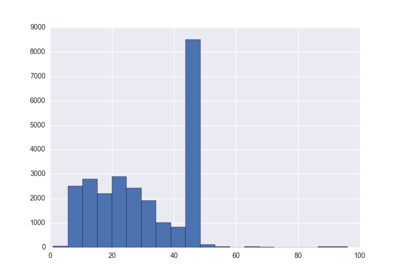

Эксперименты с malloc
=====================

Как известно, в современных архитектурах x86(\_64) и ARM виртуальная память
процесса линейна и непрерывна, ибо, к счастью, прошли времена `char near*` и
`int huge*`. Виртуальная память поделена на страницы, типичный размер которых
4 KiB, и по-умолчанию они не отображены на физическую память (mapping), так что
работать с ними не получится. Чтобы посмотреть текущие отображённые интервалы
адресов у процесса, в Linux смотрим `/proc/<pid>/maps`, в MacOSX `vmmap <pid>`.
У каждого интервала адресов есть три вида защиты: от исполнения, от записи и от
чтения. Как видно, самый первый интервал, начинающийся с load address (
соответствующий сегменту
.text у [ELF](https://en.wikipedia.org/wiki/Executable_and_Linkable_Format) в Linux,
\_\_TEXT у [Mach-O](https://en.wikipedia.org/wiki/Mach-O) в MacOSX)
доступен на чтение и исполнение - ~~спасибо, кэп~~ очень логично. Еще можно увидеть,
что стэк по сути ничем не отличается от других интервалов, и можно быстро
вычислить его размер, вычтя из конечного адреса начальный. Отображение страниц
выполняется с помощью [mmap / munmap](http://google.com/search?q=man mmap), а защита
меняется с помощью [mprotect](http://google.com/search?q=man mprotect). Ещё
существуют [brk / sbrk](https://en.wikipedia.org/wiki/Sbrk), deprecated древние
пережитки прошлого, которые изменяют размер одного единственного интервала "данных"
и в современных системах эмулируются mmap-ом.

Все POSIX реализации malloc так или иначе упираются в перечисленные выше функции.
По сравнению с наивным выделением и освобождением страниц, округляя необходимый
размер в большую сторону, malloc имеет много преимуществ:

* оптимально управляет уже выделенной памятью
* значительно уменьшает количество обращений к ядру (ведь mmap это syscall)
* вообще абстрагирует программиста от виртуальной памяти, так что многие пользуются
malloc-ом, вообще не подозревая о существовании страниц, таблиц трансляции и т.п.

Довольно теории! Будем щупать malloc на практике. Проведем три эксперимента.
Работа будет возможна на POSIX-совместимых операционках, в частности, была проверена
работа на Linux и на MacOSX.

NULL из malloc
--------------

Начнем с банального. Если переопределить функцию из libc (равно как и любой
другой библиотеки) у себя в коде, то linker не будет против, если libc
подключается динамически (а по умолчанию именно так), и не будет ругаться на двойное
определение. К примеру, такой код

```C
#include <stdio.h>
#include <stdlib.h>

void* malloc(size_t size) {
  puts("malloc");
  return NULL;
}

int main() {
  return (int)malloc(100500);
}
```

будет печатать "malloc" и иметь нулевой код возврата (`echo $?`). Однако, давайте
проверим, что будет если вызвать какую-нибудь функцию, в недрах которой вызывается
malloc, например asprintf

```C
// program.c
#include <stdio.h>
#include <stddef.h>

void* malloc(size_t size) {
  puts("malloc");
  return NULL;
}

int main() {
  char *s = NULL;
  asprintf(&s, "%d", 0);
  printf("%p\n", s);
  return 0;
}
```

И тут будет сильно зависеть от linker-а. Если это ld / Linux, то напечатаеся

```
malloc
(nil)
```

ибо malloc вызовется наш, переопределенный, а glibc реализация printf не
использует malloc. Но при dyld / MacOSX поведение другое

```
0x7fc1eb403230
```

На самом деле malloc на маке не переопределился! Дело должно быть в многоуровневых
пространствах имен dyld. Ну-ка, ну-ка...

```
DYLD_FORCE_FLAT_NAMESPACE=1 ./program
Segmentation fault: 11
```

Хрясь БАБАХ бдыжь! Дело по всей видимости даже не дошло до int main(). В чем же дело?

<details>
<summary>lldb</summary>
<pre>
lldb ./program
(lldb) target create "./program"
Current executable set to './program' (x86_64).
(lldb) env DYLD_FORCE_FLAT_NAMESPACE=1
(lldb) r
Process 11956 launched: './program' (x86_64)
Process 11956 stopped
* thread #1: tid = 0x12e214, 0x00007fff9ebb9dcb libsystem_kernel.dylib`ioctl + 67, stop reason = EXC_BAD_ACCESS (code=2, address=0x7fff5f3ffff8)
    frame #0: 0x00007fff9ebb9dcb libsystem_kernel.dylib`ioctl + 67
libsystem_kernel.dylib`ioctl:
->  0x7fff9ebb9dcb <+67>: movq   %rcx, -0xb8(%rbp)
    0x7fff9ebb9dd2 <+74>: movq   %rdx, -0xc0(%rbp)
    0x7fff9ebb9dd9 <+81>: leaq   -0xd0(%rbp), %rax
    0x7fff9ebb9de0 <+88>: movq   %rax, -0x10(%rbp)
(lldb) bt
* thread #1: tid = 0x12e214, 0x00007fff9ebb9dcb libsystem_kernel.dylib`ioctl + 67, stop reason = EXC_BAD_ACCESS (code=2, address=0x7fff5f3ffff8)
  * frame #0: 0x00007fff9ebb9dcb libsystem_kernel.dylib`ioctl + 67
    frame #1: 0x00007fff9a20f2c8 libsystem_c.dylib`isatty + 43
    frame #2: 0x00007fff9a222ac6 libsystem_c.dylib`__smakebuf + 60
    frame #3: 0x00007fff9a237b4a libsystem_c.dylib`__swsetup + 155
    frame #4: 0x00007fff9a221d52 libsystem_c.dylib`__sfvwrite + 73
    frame #5: 0x00007fff9a2264c9 libsystem_c.dylib`puts + 144
    frame #6: 0x0000000100000f0b program`malloc(size=4096) + 27 at program.c:6
    frame #7: 0x00007fff9a222af6 libsystem_c.dylib`__smakebuf + 108
    frame #8: 0x00007fff9a237b4a libsystem_c.dylib`__swsetup + 155
    ...
    frame #130931: 0x0000000100000f0b program`malloc(size=4096) + 27 at program.c:6
    frame #130932: 0x00007fff9a222af6 libsystem_c.dylib`__smakebuf + 108
    frame #130933: 0x00007fff9a237b4a libsystem_c.dylib`__swsetup + 155
    frame #130934: 0x00007fff9a221d52 libsystem_c.dylib`__sfvwrite + 73
    frame #130935: 0x00007fff9a2264c9 libsystem_c.dylib`puts + 144
    frame #130936: 0x0000000100000f0b program`malloc(size=8) + 27 at program.c:6
    frame #130937: 0x00007fff5fc1d22e dyld`operator new(unsigned long) + 30
    frame #130938: 0x00007fff5fc095a5 dyld`std::__1::vector<char const* (*)(dyld_image_states, unsigned int, dyld_image_info const*), std::__1::allocator<char const* (*)(dyld_image_states, unsigned int, dyld_image_info const*)> >::insert(std::__1::__wrap_iter<char const* (* const*)(dyld_image_states, unsigned int, dyld_image_info const*)>, char const* (* const&)(dyld_image_states, unsigned int, dyld_image_info const*)) + 343
    frame #130939: 0x00007fff5fc04507 dyld`dyld::registerImageStateBatchChangeHandler(dyld_image_states, char const* (*)(dyld_image_states, unsigned int, dyld_image_info const*)) + 147
    frame #130940: 0x00007fff8bb8089e libdyld.dylib`dyld_register_image_state_change_handler + 76
    frame #130941: 0x00007fff8bb8065f libdyld.dylib`_dyld_initializer + 47
    frame #130942: 0x00007fff982829fd libSystem.B.dylib`libSystem_initializer + 116
    frame #130943: 0x00007fff5fc12feb dyld`ImageLoaderMachO::doModInitFunctions(ImageLoader::LinkContext const&) + 265
    frame #130944: 0x00007fff5fc13164 dyld`ImageLoaderMachO::doInitialization(ImageLoader::LinkContext const&) + 40
    frame #130945: 0x00007fff5fc0f79d dyld`ImageLoader::recursiveInitialization(ImageLoader::LinkContext const&, unsigned int, ImageLoader::InitializerTimingList&, ImageLoader::UninitedUpwards&) + 305
    frame #130946: 0x00007fff5fc0f732 dyld`ImageLoader::recursiveInitialization(ImageLoader::LinkContext const&, unsigned int, ImageLoader::InitializerTimingList&, ImageLoader::UninitedUpwards&) + 198
    frame #130947: 0x00007fff5fc0f623 dyld`ImageLoader::processInitializers(ImageLoader::LinkContext const&, unsigned int, ImageLoader::InitializerTimingList&, ImageLoader::UninitedUpwards&) + 127
    frame #130948: 0x00007fff5fc0f893 dyld`ImageLoader::runInitializers(ImageLoader::LinkContext const&, ImageLoader::InitializerTimingList&) + 75
    frame #130949: 0x00007fff5fc020f1 dyld`dyld::initializeMainExecutable() + 208
    frame #130950: 0x00007fff5fc05e5d dyld`dyld::_main(macho_header const*, unsigned long, int, char const**, char const**, char const**, unsigned long*) + 3793
    frame #130951: 0x00007fff5fc01276 dyld`dyldbootstrap::start(macho_header const*, int, char const**, long, macho_header const*, unsigned long*) + 512
    frame #130952: 0x00007fff5fc01036 dyld`_dyld_start + 54
</pre>
</details>

Какой-какой фрейм? 130952-ый? Да у нас оказывается stack overflow! А еще мы узнали
несколько любопытных вещей: dyld написан на C++, а puts зачем-то выделяет память
тем самым malloc-ом, создавая рекурсию. Хочется верить, что он так поступает всего один раз
при инициализации stdout-буфера, ну а мы вынуждены его заменить

```C
#include <stdio.h>
#include <stddef.h>
#include <unistd.h>

void* malloc(size_t size) {
  write(STDOUT_FILENO, "malloc\n", 7);
  return NULL;
}

int main() {
  char *s = NULL;
  asprintf(&s, "%d", 0);
  printf("%p\n", s);
  return 0;
}
```

запускаем и видим

```
malloc
malloc
malloc
Segmentation fault: 11
```

Фрагмент стэка:

```
* thread #1: tid = 0x1309af, 0x00007fff5fc249ce dyld`_platform_bzero + 94, stop reason = EXC_BAD_ACCESS (code=1, address=0x8)
  * frame #0: 0x00007fff5fc249ce dyld`_platform_bzero + 94
    frame #1: 0x00007fff5fc14045 dyld`calloc + 52
    frame #2: 0x00007fff5fc0ce14 dyld`__cxa_get_globals + 100
    frame #3: 0x00007fff5fc1ce7f dyld`__cxa_throw + 25
    frame #4: 0x00007fff5fc1d267 dyld`operator new(unsigned long) + 87
```

Итак, видно, что в отличие от GNU/Linux, ld которого сделан на статической аллокации,
при запуске приложения в MacOSX интенсивно используется куча. Также видно, что
выброс исключения про неудавшееся выделение памяти
оператором new вызывает calloc, который, как мы помним, есть комбинация из malloc +
заполнение нулями (bzero). Реализация calloc попалась бажная и не проверила
нулевой указатель. С этим знанием мне теперь не будет давать покоя мысль, что будет,
если в MacOSX по-настоящему закончится память, что называется, до последнего байта.
Очевидно, что правильным и логичным решением было бы заранее выделять память для
std::bad_alloc.

ОК, Гугл, как нам все-таки переопределить malloc под MacOSX, так чтобы ничего не падало?
Придется погрузиться в детали реализации. malloc на маке выделяет память в зонах.
Изначально зона всего одна, по умолчанию, и именно ее покажет vmmap в конце вывода.
У каждой зоны хранятся указатели на malloc, free и realloc, что позволяет гибко
настраивать управление памятью. Можно взять дефолтную зону и заменить в ней указатель
на malloc

```C
#include <stdio.h>
#include <stddef.h>
#include <unistd.h>
#include <malloc/malloc.h>
#include <sys/mman.h>

void* zone_malloc(struct _malloc_zone_t *zone, size_t size) {
  write(STDOUT_FILENO, "malloc\n", 7);
  return NULL;
}

int main() {
  malloc_zone_t* zone = malloc_default_zone();
  mprotect(zone, sizeof(*zone), PROT_READ | PROT_WRITE);
  zone->malloc = zone_malloc;
  mprotect(zone, sizeof(*zone), PROT_READ);

  char *s = NULL;
  asprintf(&s, "%d", 0);
  printf("%p\n", s);
  return 0;
}
```

Обратите внимание на mprotect. Изначально malloc_default_zone возвращает указатель
на область памяти, которая защищена от записи. В этом легко убедиться,
запустив программу без mprotect и исследовав падение в отладчике и vmmap-е. Такая
защита получается от шаловливых рук... Обратно на PROT_READ строго говоря защиту
можно было и не менять, добавлено ради порядка. Что напечатается:

```
malloc
malloc
0x0
```

Видим, что printf использовал malloc, но потом нашел в себе силы обойтись без
динамической памяти и всё равно распечатал нулевой указатель.

К слову о зонах. malloc в glibc использует похожий поход, который назвали
obstacks. С одной стороны, для работы с ними существует [много функций](http://www.gnu.org/software/libc/manual/html_node/Obstacks.html#Obstacks),
с другой стороны, отсутствует возможность применять в разных obstack-ах разные
алгоритмы выделения памяти.

Неэффективный malloc
--------------------

Поставим теперь себе новую цель: создадим динамическую библиотеку, в которой
реализуем свою версию malloc.

```C
// hack_malloc.c
#define _GNU_SOURCE
#include <stdio.h>
#include <stddef.h>
#include <unistd.h>
#include <sys/mman.h>

void* malloc(size_t size) {
  write(STDOUT_FILENO, "malloc... ", 10);
  size += sizeof(size_t);
  int page_size = getpagesize();
  int rem = size % page_size;
  if (rem > 0) {
    size += page_size - rem;
  }
  void* addr = mmap(0, size, PROT_READ | PROT_WRITE,
                    MAP_ANONYMOUS | MAP_PRIVATE, -1, 0);
  if (addr == MAP_FAILED) {
    write(STDOUT_FILENO, "fail\n", 5);
    return NULL;
  }
  write(STDOUT_FILENO, "ok\n", 3);
  *(size_t*)addr = size;
  return (size_t*)addr + 1;
}

void free (void *ptr) {
  write(STDOUT_FILENO, "free... ", 8);
  size_t* real_ptr = (size_t*)ptr - 1;
  if (!munmap(real_ptr, *real_ptr)) {
    write(STDOUT_FILENO, "ok\n", 3);
  } else {
    write(STDOUT_FILENO, "fail\n", 5);
  }
}
```

Здесь реализуется простейший подход, когда мы выделяем память страницами. Приходится
хранить в начале страницы размер, чтобы было что передать в unmap. MAP_ANONYMOUS
в флагах mmap означает, что мы делаем отображение в память не реальный файл, а
физическую память (обычно mmap-ом отображают в память именно файлы - это даёт
ускорение в некоторых операциях). MAP_PRIVATE в случае файлов создавал бы
индивидуальную копию при записи (copy-on-write), но для нас по сути ничего не
делает, просто документация требует присутствия либо MAP_PRIVATE, либо
MAP_SHARED. Кстати, с MAP_SHARED этот код тоже прекрасно работает.

Проверять будем на примере

```C
// test.c
#include <stdio.h>
#include <stdlib.h>

int main() {
  printf("start\n");
  void* mem = malloc(100);
  printf("malloc() -> %p\n", mem);
  *(int*)mem = 0;
  free(mem);
  printf("end\n");
  return 0;
}
```

Собирать будем так

```
#Linux
gcc -shared -o libhackmalloc.so -fPIC -std=c99 -O2 hack_malloc.c
gcc test.c -std=c99 -L. -Wl,-rpath,. -lhackmalloc -O2 -o test

# MacOSX
clang -dynamiclib -undefined suppress -flat_namespace -std=c99 -fPIC -O2 hack_malloc.c -o libhackmalloc.dylib
clang test.c -std=c99 -L. -lhackmalloc -O2 -o test
```

При запуске увидим

```
./test
start
malloc... ok
malloc() -> 0x10935b008
free... ok
end
```

Вывод для MacOSX и Linux идентичный. В случае MacOSX вспоминаем про пространства
имен dyld и делаем их плоскими как *шутка не прошла цензуру*

```
DYLD_FORCE_FLAT_NAMESPACE=1 ./test
malloc... ok
malloc... ok
free... ok
malloc... ok
malloc... ok
free... fail
free... fail
free... fail
malloc... ok
malloc... ok
free... fail
malloc... ok
free... fail
free... fail
free... fail
free... fail
free... fail
free... fail
free... fail
free... fail
free... fail
free... fail
free... fail
free... fail
free... fail
free... fail
free... fail
free... fail
free... fail
free... fail
free... fail
free... fail
free... fail
free... fail
free... fail
free... fail
free... fail
free... fail
free... fail
free... fail
free... fail
free... fail
free... fail
free... fail
free... fail
free... fail
free... fail
free... fail
free... fail
free... fail
free... fail
free... fail
free... fail
free... fail
free... fail
free... fail
free... fail
free... fail
free... fail
free... fail
free... fail
free... fail
free... fail
free... fail
free... fail
free... fail
free... fail
free... fail
free... fail
free... fail
free... fail
free... fail
free... fail
free... fail
free... fail
free... fail
free... fail
free... fail
free... fail
free... fail
free... fail
free... fail
free... fail
malloc... ok
malloc... ok
malloc... ok
malloc... ok
malloc... ok
malloc... ok
malloc... ok
malloc... ok
malloc... ok
malloc... ok
malloc... ok
malloc... ok
malloc... ok
malloc... ok
malloc... ok
malloc... ok
malloc... ok
malloc... ok
free... ok
malloc... ok
malloc... ok
malloc... ok
free... fail
malloc... ok
start
malloc... ok
malloc() -> 0x1035d9008
free... ok
end
```

Программа отработала и уже хорошо. Что удивительно - явное несоответствие между
количеством вызовов malloc и free перед int main(). А еще free много раз
завершался неудачно. Интересующиеся могут запустить test в отладчике, поставить
бряку на free и узнать про темную жизнь dyld много нового, а мы будем двигаться
дальше.

Шпионим за malloc
-----------------

Попробуем использовать технику DLL injection чтобы внедрять свой malloc в чужие
программы. Писать свою эффективную реализацию кучи пока что не хочется, и мы
применим трюк с RTLD_NEXT. Рассмотрим такой код

```C
// trace_malloc.c
#define _GNU_SOURCE
#include <dlfcn.h>
#include <fcntl.h>
#include <stdio.h>
#include <unistd.h>

int fd = 0;
void* (*__malloc)(size_t) = NULL;

void* malloc(size_t size) {
  if (!__malloc) {
    __malloc = (void*(*)(size_t)) dlsym(RTLD_NEXT, "malloc");
  }
  if (!fd) {
    fd = open("malloc.log", O_WRONLY | O_CREAT | O_TRUNC, 0666);
  }
  /* ... */
  write(fd, record, sprintf(record, "%ld.%06ld\t%zu\n", sec, mcsec, size));
  return __malloc(size);
}
```

Ссылка на полную версию кода будет дана в конце статьи.
Его половину съела кроссплатформенная реализация clock_gettime, а вторую
обращение к clock_gettime, так что я был вынужден немного сократить. Вся прелесть
в одной единственной строчке

```C
__malloc = (void*(*)(size_t)) dlsym(RTLD_NEXT, "malloc");
```

в которой мы подгружаем "предыдущий" malloc. Обычно dlsym используют для
вытаскивания функций из загруженных динамических библиотек, но у нас в качестве
дескриптора библиотеки использован магический RTLD_NEXT. Строго говоря,
в POSIX его нет, но по факту его поддерживают многие linker-ы. Итак, мы получаем
указатель на истинный malloc, сохраняем его и впоследствии вызываем, возвращая
его результат. Попутно логируем все вызовы.

Собираем так же как и hack_malloc.c, используем на Linux-е так:

```
LD_PRELOAD=/path/to/libtracemalloc.so program
```

Путь обязательно должен быть абсолютным, иначе магия не случится. LD_PRELOAD -
специальная переменная окружения, которая насильно подгружает указанные библиотеки
перед основными, с которыми собрана программа. Таким образом можно переопределять
произвольные функции или решать временные проблемы с запуском неправильно
скомпонованых программ (то самое сообщение lib*.so: not found).

ls, к примеру, создаёт около 2 KB лога. А whoami упадет с сообщением
undefined symbol: dlsym, потому что dlsym определен в libdl.so, который
некоторые подгружают, а некоторые нет. И нет смысла собирать libtracemalloc с
-ldl, т.к. LD_PRELOAD не будет подгружать зависимости инжектируемых библиотек.
Придется делать как-то так:

```
LD_PRELOAD=/usr/lib/.../libdl.so:/path/to/libtracemalloc.so whoami
```

и мы увидим килобайт лога выделений памяти даже в случае такой элементарной утилиты.

ОК, а что там с MacOSX? dyld поддерживает переменную окружения DYLD_INSERT_LIBRARIES,
которая делает аналогичные вещи. Пробуем

```
DYLD_INSERT_LIBRARIES=/path/to/libtracemalloc.dylib ls
```

...не получается, вспоминаем про пространства имен

```
DYLD_INSERT_LIBRARIES=/path/to/libtracemalloc.dylib DYLD_FORCE_FLAT_NAMESPACE=1 ls
```

...и снова облом. Уже интересно! Оказывается, дело в защите системных программ
[System Integrity Protection](https://en.wikipedia.org/wiki/System_Integrity_Protection).
Этот механизм с помощью расширенных файловых атрибутов не даёт изменять файлы,
инжектить код, дебажить по путям вроде /System, /usr и т.д. К счастью, /usr/local помиловали.

```
lldb /bin/ls
(lldb) target create "/bin/ls"
Current executable set to '/bin/ls' (x86_64).
(lldb) r
error: process exited with status -1 (cannot attach to process due to System Integrity Protection)
```

SIP можно отключить, но мы поступим проще - будем копировать интересующие нас программы
в свою директорию

```
cp $(which ls) .
DYLD_INSERT_LIBRARIES=/path/to/libtracemalloc.dylib DYLD_FORCE_FLAT_NAMESPACE=1 ./ls
```

Так уже работает. В заключение докажем известный тезис о двух типах выделения памяти.
Соберем лог malloc-а и построим гистограмму распределения размеров с помощью
элементарного кода на IPython:

```Python
%pylab
import pandas, seaborn
log = pandas.DataFrame.from_csv("malloc.log", sep='\t')
log[log < 100].hist()
log[log < 100].count() / len(log)
```

На гистограмме размеров будет видна типичная картина (Y-количество, X-размер,
программа - clang):



Я специально обрезал хвост на 100 байтах, т.к. выделения большего размера настолько
редки что становятся не видны на гистограмме. Итак, 98% всех выделений памяти в
куче меньше, чем 100 байт, а значит, хороший malloc должен обслуживать минимум
два отдельных домена: для больших объектов и для всех остальных.

Заметим, что для того чтобы проанализировать вашу программу, можно не возиться
с самосборной библиотекой вроде описанной выше, а взять уже готовую. Например,
[tcmalloc](http://goog-perftools.sourceforge.net/doc/heap_profiler.html) позволяет
профилировать кучу и делать много другого полезного.

Код из статьи доступен на [гитхабе](https://github.com/vmarkovtsev/hack_malloc).

В следующий раз мы возьмём настоящую, большую программу, соберём лог выделений
памяти во время ее работы и попробуем делать предсказания на основе LSTM модели
рекурсивной нейронной сети.
