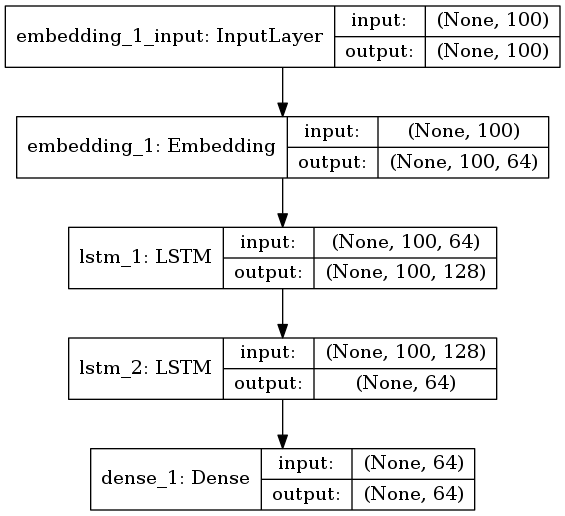

Больше года назад, когда я работал антиспамщиком в Mail.Ru Group, на меня накатило и я написал [Эксперименты с malloc](https://habrahabr.ru/company/mailru/blog/281497/). В то время я в свое удовольствие помогал проводить семинары по АКОСу на ФИВТе [МФТИ](http://mipt.ru), и шла тема про аллокацию памяти. Тема большая и очень интересная, при этом охватывает как низкий уровень ядра, так и вполне себе алгоритмоемкие структуры. Во всех учебниках написано, что одна из основных проблем динамического распределения памяти это ее непредсказуемость. Как говорится, знал бы прикуп - жил бы в Сочи. Если бы оракул заранее рассказал весь план по которому будет выделяться и освобождаться память, то можно было составить оптимальную стратегию, минимизирующую фрагментацию кучи, пиковое потребление памяти и т.д. Отсюда пошла возня с ручными аллокаторами. В процессе раздумий я натолкнулся на отсутствие инструментов логирования `malloc()` и `free()`. Пришлось их написать! - как раз про это была статья (а ещe я изучал macOS). Были запланированы две части, однако жизнь круто повернулась и стало не до `malloc()`. Итак, пора восстановить справедливость и реализовать обещанное: *ударить глубоким обучением по предсказанию работы с кучей*.

Внутри:

* Совершенствуем `libtracemalloc`, перехватчик `malloc()`.
* Строим LSTM на Keras - глубокую рекуррентную сеть.
* Обучаем модель на примере работы реального приложения ([vcmi/vcmi](https://github.com/vcmi/vcmi) - а вы думали, причем здесь Heroes III?).
* Удивляемся неожиданно хорошим результатам.
* Фантазируем про практическое применение технологии.
* [Исходники](https://github.com/vmarkovtsev/hack_malloc).

Интересно? Приходите на конференцию 3 июня в Москве, посвященную этой и смежным темам (не аффилировано с Mail.Ru): [source{d} tech talks](http://talks.sourced.tech/machine-learning-2017/).

<habracut/>

### libtracemalloc

В первой статье мы логгировали только `malloc()`. У той реализации было несколько минусов:

1. Многопоточность игнорировалась при сериализации вызовов. Другими словами, мы теряли информацию, из какого потока аллоцировали память.
2. Многопоточность игнорировалась при записи в файл. Вызов `write()` производился конкурентно, без мютекса. Несмотря на то что POSIX требует его атомарности, [в Linux до версии 3.14 был неприятный баг с позиционированием, который исправил сам Главный](https://patchwork.kernel.org/patch/3755941/), и [некоторые до сих пор проверяют это свойство на практике](https://github.com/fsaintjacques/experiments/tree/master/append-atomicity).
3. Не логировался `free()`.

Следующий код исправляет (1) и (2):

```C
int fd = 0;
void* (*__malloc)(size_t) = NULL;
pthread_mutex_t write_sync = PTHREAD_MUTEX_INITIALIZER;

inline void get_time(long* sec, long* mcsec) { /* ... */ }

void* malloc(size_t size) {
  if (!__malloc) {
    __malloc = (void*(*)(size_t)) dlsym(RTLD_NEXT, "malloc");
  }
  if (!fd) {
    fd = open(LOG, O_WRONLY | O_CREAT | O_EXCL, 0666);
    if (fd < 0) {
      return __malloc(size);
    }
  }  
  long sec, mcsec;
  get_time(&sec, &mcsec);
  void* ptr = __malloc(size);
  char record[64];
  pthread_mutex_lock(&write_sync);
  write(fd, record, sprintf(record, "%ld.%06ld\t%ld\t%zu\t%p\n",
                            sec, mcsec, pthread_self(), size, ptr));
  pthread_mutex_unlock(&write_sync);
  return ptr;
}
```

Соответственно, мы используем `pthread_self()` и выполняем `write()` под мютексом. Если присмотреться, то можно еще увидеть `O_EXCL` во флагах у `open()`. Я добавил его чтобы исправить поведение при раннем `fork()`, т.е. до начала работы с кучей. Два форкнутых процесса одновременно открывали файл и перезаписывали друг друга.

Остается исправить (3):

```C
void (*__free)(void*) = NULL;

void free (void *ptr) {
  if (!__free) {
    __free = (void(*)(void*)) dlsym(RTLD_NEXT, "free");
  }
  if (!fd) {
    __free(ptr);
    return;
  }  
  long sec, mcsec;
  get_time(&sec, &mcsec);
  char record[64];
  pthread_mutex_lock(&write_sync);
  write(fd, record, sprintf(record, "%ld.%06ld\t%ld\t-1\t%p\n",
                            sec, mcsec, pthread_self(), ptr));
  pthread_mutex_unlock(&write_sync);
  __free(ptr);
}
```

Логирование происходит полностью по аналогии с `malloc()`.

В результате, получаем примерно следующее:

```
0.000000        140132355127680 552     0x2874040
0.000047        140132355127680 120     0x2874270
0.000052        140132355127680 1024    0x28742f0
0.000079        140132355127680 -1      0x2874270
0.000089        140132355127680 -1      0x28742f0
0.000092        140132355127680 -1      0x2874040
0.000093        140132355127680 -1      (nil)
0.000101        140132355127680 37      0x2874040
0.000133        140132355127680 32816   0x2874070
0.000157        140132355127680 -1      0x2874070
0.000162        140132355127680 8       0x2874070
```

### LSTM на Keras

Для начала, определимся что конкретно мы хотим предсказывать. Хочется предсказывать по предшествующей истории вызовов `malloc()` и `free()` последовательность будущих, причем сразу с размером. Было бы очень круто применить внимание (attention) и сразу указывать, какие участки памяти будут освобождаться, однако предлагаю этим заняться пытливому читателю - выйдет отличная дипломная работа. Здесь я поступлю проще и буду предсказывать какой объем памяти освобождается.

Следующий момент состоит в том, что предсказывать точный размер по RMSE это тухлая и гиблая затея. Я пробовал - сеть предательски сходится к среднему значению на всем датасете. Поэтому я ввожу классы размеров по степеням двойки, прямо как у известнейшего [buddy allocator](https://en.wikipedia.org/wiki/Buddy_memory_allocation). Другими словами, задача предсказания ставится как задача классификации. Пример:

| размер | класс |
|--------|-------|
| 1      | 1     |
| 2      | 2     |
| 3      | 2     |
| 4      | 3     |
| 5      | 3     |
| 6      | 3     |

Всего имеем 32 класса, поставив мысленное (некорректное) ограничение на `malloc(uint32_t size)`. На самом деле там 64-битный `size_t` и можно выделять больше 4ГиБ.

Класс у `free()` будем брать у соответствующего вызова `malloc()`, т.к. нам известен указатель на освобождаемую память. Чтобы как-то отличать классы `malloc()` от классов `free()`, прибавим к последним 32. Итого всего 64 класса. Это, прямо скажем, совсем немного. Если в наших данных есть какие-то закономерности, то любая даже самая глупая сеть должна чему-то на них обучиться. Следующий код парсит лог полученный от `libtracemalloc`.

```python
threads = defaultdict(list)
ptrs = {}
with gzip.open(args.input) as fin:
    for line in fin:
        parts = line[:-1].split(b"\t")
        thread = int(parts[1])
        size = int(parts[2])
        ptr = parts[3]
        if size > -1:
            threads[thread].append(size.bit_length())
            ptrs[ptr] = size
        else:
            size = ptrs.get(ptr, 0)
            if size > 0:
                del ptrs[ptr]
            threads[thread].append(32 + size.bit_length())
```

Как видно, мы сохраняем новые указатели и удаляем старые, как бы эмулируя кучу. Теперь нужно превратить словарь `threads` в удобоваримые `x` и `y`.

```python
train_size = sum(max(0, len(v) - maxlen) for v in threads.values())
try:
    x = numpy.zeros((train_size, maxlen), dtype=numpy.int8)
except MemoryError as e:
    log.error("failed to allocate %d bytes", train_size * maxlen)
    raise e from None
y = numpy.zeros((train_size, 64), dtype=numpy.int8)
offset = 0
for _, allocs in sorted(threads.items()):
    for i in range(maxlen, len(allocs)):
        x[offset] = allocs[i - maxlen:i]
        y[offset, allocs[i].bit_length()] = 1
        offset += 1
```

Здесь `maxlen` - длина контекста, по которому будем предсказывать. По умолчанию я выставил ее в 100. Остается создать саму модель.

```python
from keras import models, layers, regularizers, optimizers

model = models.Sequential()
embedding = numpy.zeros((64, 64), dtype=numpy.float32)
numpy.fill_diagonal(embedding, 1)
model.add(layers.embeddings.Embedding(
    64, 64, input_length=x[0].shape[-1], weights=[embedding],
    trainable=False))
model.add(getattr(layers, layer_type)(
    neurons, dropout=dropout, recurrent_dropout=recurrent_dropout,
    return_sequences=True))
model.add(getattr(layers, layer_type)(
    neurons // 2, dropout=dropout, recurrent_dropout=recurrent_dropout))
model.add(layers.Dense(y[0].shape[-1], activation="softmax"))
optimizer = getattr(optimizers, optimizer)(lr=learning_rate, clipnorm=1.)
model.compile(loss="categorical_crossentropy", optimizer=optimizer,
              metrics=["accuracy", "top_k_categorical_accuracy"])
```



Чтобы бережно обращаться с памятью, я применяю нетренируемый Embedding и не делаю one hot encoding заранее. Т.о. `x` и `y` у меня 8-битные (64 < 256), а минибатч 32-битный. Это важно, потому что совсем недолго работающие программы успевают сгенерировать десятки миллионов сэмплов. `neurons` по умолчанию 128, никаких дропаутов нет. Начнем обучение!

```python
model.fit(x, y, batch_size=batch_size, epochs=epochs,
          validation_split=validation)
```

Я был вынужден сделать `export TF_CPP_MIN_LOG_LEVEL=1`, в противном случае Tensorflow спамил PoolAllocator-ами.

### Результаты

В качестве подопытного возьмем [vcmi/vcmi](https://github.com/vcmi/vcmi) - GPL реализацию движка третьих героев, в которую я бывало контрибьютил. Очень полная и неплохая кстати реализация, но ребятам срочно нужны автотесты. И раз уж зашла речь, очень хочется прикрутить Python API к движку и попробовать реализовать нейросетевой AI. Иногда люди возражают, говорят что Герои имеют много степеней свободы. Я на это отвечаю что никто не заставляет сразу делать AlphaGo, можно начать с малого, с боев.

Склонируем, соберем код vcmi, добудем оригинальные ресурсы, запустим игру и соберем лог вызовов кучи:

```
# ... easy ...
LD_PRELOAD=/path/to/libtracemalloc.so /path/to/vcmiclient
```

Я запустил Arrogance, побродил пару недель, пособирал ресурсы. Скорость проседает сильно, однако это вам не valgrind. Полученный лог выгрузил на [Google Drive](https://drive.google.com/open?id=0B-w8jGUJto0iY3JycW1BVGluS0U) - 94MiB. Обучение заняло 10.5 часов на эпоху на паскальном Титане (2 эпохи, 21 ч, `validation_split` = 15%). В целом, вторая эпоха не сильно изменяет результат и достаточно всего одной. Получились такие метрики:

```
loss: 0.0512
val_loss: 0.1160
acc: 0.9837
val_acc: 0.9711
top_k_categorical_accuracy: 1.0000
val_top_k_categorical_accuracy: 0.9978
```

По-моему, вышло очень здорово. Мы достигли 97% accuracy по валидации, что означает примерно 20 верных предсказаний с точностью выше 50%. Если заменить LSTM на GRU, то получится сократить время эпохи до 8 часов при незначительно лучших достигнутых метриках. 

Какие я вижу векторы развития модели:

1. Наращивание числа нейронов "в лоб" возможно даст улучшение метрик.
2. Эксперименты с архитектурой, метапараметрами. Как минимум нужно исследовать зависимость от длины контекста и числа слоев.
3. Обогащение контекста предсказания, развернув стек вызовов и применив debuginfo. От цепочки функций до полного исходного кода.

Размер обученной модели - 1 мегабайт, что сильно меньше полной истории - 98МБ в gzip. Уверен, что хорошенько потюнив сеть, получится его сократить без ущерба качества.

### Будущее

 "Постойте, - скажет читатель, - никто в здравом уме не будет прогонять сеть вперед при каждом вызове malloc". Конечно, когда на счету каждый цикл, перемножать матрицы 128 на 100 на 64 выглядит глупо. Но у меня есть возражения:

 1. Нужно запускать сеть каждые 20 вызовов, или даже реже. Если улучшить технологию, это число возрастет.
 2. Многоядерные процессоры давно стали обыденностью, и используются они далеко не на 100%. В периоды простоя программы, на блоке в каком-нибудь `read()`, у нас есть ощутимый квант времени и ресурсы для inference.
 3. Не за горами нейроакселераторы. [TPU](https://en.wikipedia.org/wiki/Tensor_processing_unit) уже изготавливают [Google](https://cloud.google.com/tpu/), [IBM](http://www.research.ibm.com/articles/brain-chip.shtml), [Samsung](http://www.androidauthority.com/closer-look-samsung-mongoose-cpu-712587/). Почему бы их не использовать для ускорения существующих "простых" программ, анализируя в динамике их поведение и динамически адаптируя к ним рантайм.
 
Машинное обучение на исходном коде - новая, захватывающая тема. Приходите на конференцию [source{d} tech talks](http://talks.sourced.tech/machine-learning-2017/) 3 июня, там выступит Чальз Саттон - автор половины всех статей и Джорджиос Гусиус - звезда Mining Software Repositories и родоначальник GHTorrent. Участие бесплатное, и будут усиленно кормить в перерывах.
